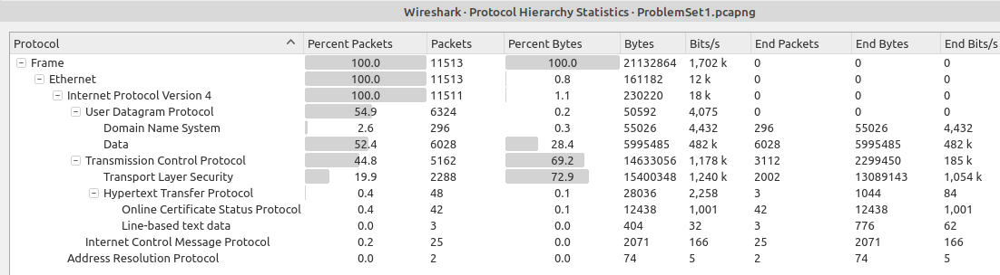
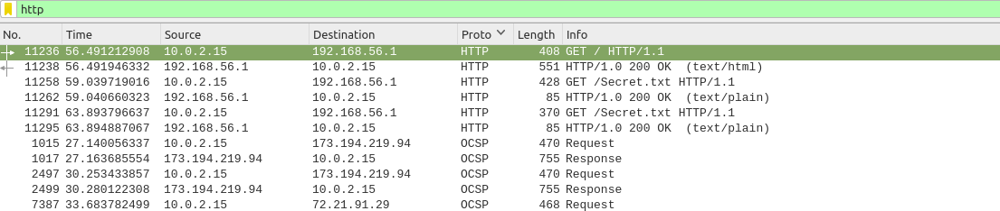
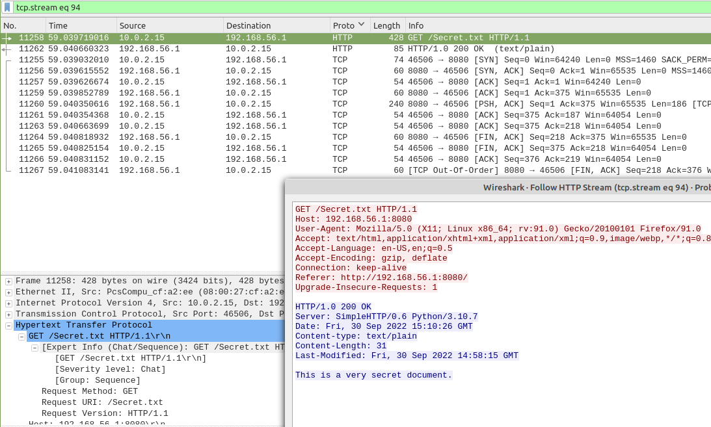
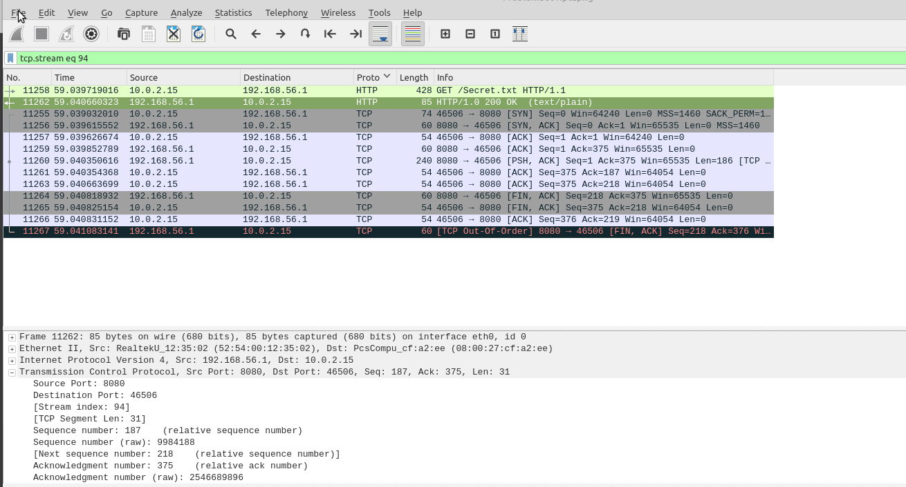

# Description
A PCAP was sent to you that apparently had evidence of leakage through file downloads. What was the IP address of the computer hosting a secret file for download?

Flag Format: XXX.XXX.XXX.XXX:ZZZZZ

# Solution
Open the PCAP within Wireshark to visualize the protocol hierarchy and identify the potential ways to transfer data. HTTP, DNS, and ICMP are commonly used protocols to exfil data or bypass security solutions. 

Filtering on HTTP traffic clearly displays GET requests to 192.168.56.1 and port 8080.

The first GET request returns a webpage with a link to `Secret.txt` and a subsequent request followed for the text file which contained the string "This is a very secret document.". 

The alternative option to investigating the web traffic and streams is to review the HTTP export object list since the traffic was unencrypted.

Ensure that the text file has no hidden control characters otherwise the hash will be wrong (unlikely to have a collision).
Linux: `md5sum Secret.txt -----> 35ff153813cb42f626bf8d8a15f540fc` 
Windows: `certutil -hashfile Secret.txt MD5`
